## unpackme-upx (PicoCTF)

**Challenge**: 
Can you get the flag?\
Reverse engineer this [binary](https://artifacts.picoctf.net/c/203/unpackme-upx).

**Challenge Instruction**:
Do the usual - download in your desired directory through `wget "https://artifacts.picoctf.net/c/203/unpackme-upx"`\
Make it an executable using `chmod +x <file-name>`

**Solution**:
After downloading the binary, I analysed what sort of file it was through the `file` command.

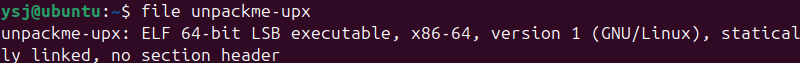

As shown in the image above, it is a 64-bit ELF file, that is statically linked - not too much information.

Next, I ran the file to see what sort of response/hint it would give:

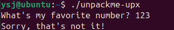

This tells me that, if I input the correct value, it should get me somewhere.

So, I run `GDB` and see what values I can find. 

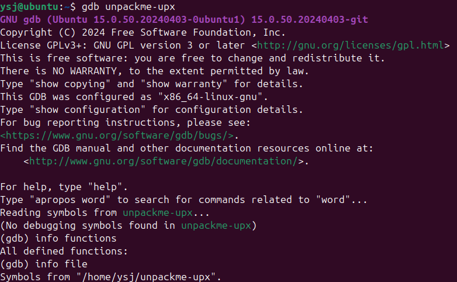

The functions and symbols seem to be hidden, and I need to find a way to reveal it.

I exit `GDB` and run `strings` on the executable to see if I can find some other hint:

`strings unpackme-upx`

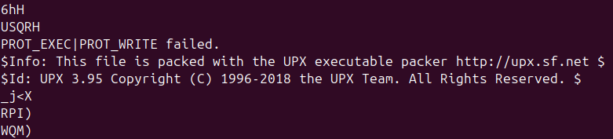

This line looks worth looking into. According to this, the executable has been packed using [UPX](https://github.com/upx/upx) (also hinted through the name of the executable).

According to the link, UPX is an open-source executable compressor, and it can also be used to decompress the executable as well.

I download UPX, and run it through `upx -d unpackme-upx`. The option `-d` was provided to specify decompression.

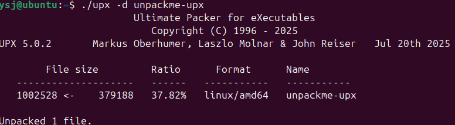

Now if I go into `GDB` and get information of the functions, it's clear that all the functions have been unpacked and are visible.

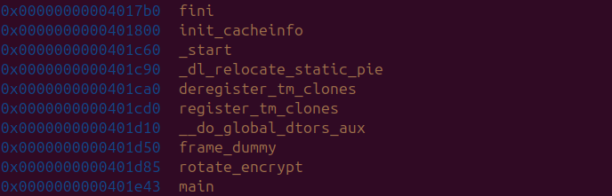

From here, I can `disassemble main`, and I prefer the Intel syntax, so I run `set disassembly-flavor intel`.

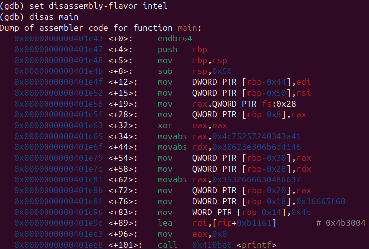

I can see the usual pattern that is happening the initial lines of instructions:

- `main+4` - `main+8` are setting up the stack frame;
- `main+12` and `main+15` are taking the arguments that are provided at execution; and
- `main+19` - `main+28` are setting up the stack canary.

After the essential instructions have been run, some values are being stored as local variables in `main+34` to `main+83`.

I tried to look into these values that were being stored but, they were incomprehensible and didn't seem all that valuable (referenced below).

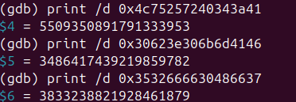

(`print /d <hex>` - print the provided number, as a decimal)

What I really wanted to focus on was the section where user input is stored, and then compared.

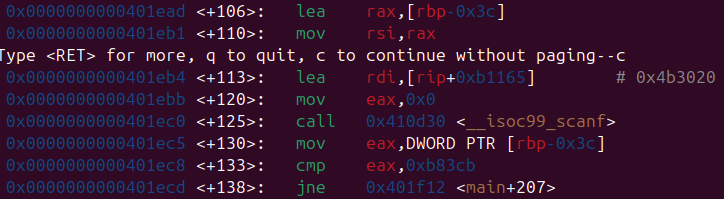

In this section, the program calls `scanf` and the user input is stored in a local variable at `rbp-0x3c`.

I break at `main+113` and then step one instruction in through the `si` command to examine the value that is stored in `rdi` as a string (`x/s $rdi`).

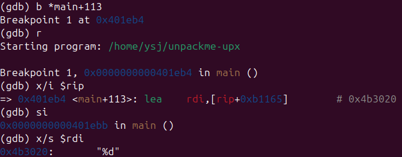

As seen above, it is evident that the format that is specified in `scanf` is `%d`, which is a decimal (just something to note for when providing final solution).

In `main+130`, the value that was provided through user input is being stored into the register `eax` (lower 4 bytes of `rax`).
And then in `main+133`, that value is then being compared with the value `0xb83cb`, or **754635** in decimal format.
After that, in `main+138`, the program jumps to `main+207` if the values are not equal (`jne`), where it will spit out an exiting line through `puts` (probably the *Sorry, that's not it!* line that was shown in the beginning), `return 0`, and then exit.

I enter the value **754635** into the prompt and am rewarded with the flag:

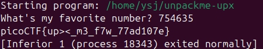

`UPX me FTW`
